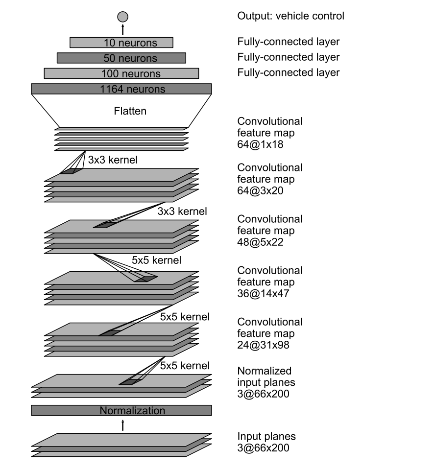

## Overview ##

This project is the behavioral cloning project to drive a car in a simulator.

## Files ##
1. model.py - The script used to create and train the model.
1. drive.py - The script to drive the car.
1. model.json - The model architecture.
1. model.h5 - The model weights.

## References ##

[Nvidia Paper] (http://images.nvidia.com/content/tegra/automotive/images/2016/solutions/pdf/end-to-end-dl-using-px.pdf)

## Method and model ##

I recorded my own images using Udacity simulator in training mode. However, Udacity had also provided their own training data which I used. 

The model that I started with is based on the Nvidia Paper. The model is as follows:

1. The first layer performs image normalization.
1. This is followed by 5 convolutional layers with relu activation for non linearity. The strided convolitions (first 3 convolutional layers) are 5x5 kernel with a 2x2 stride. The non-strided convolutions (last 2 convolutional layers) are 3x3 kernel with a 1x1 stride.
1. The convolutions are then followed by 3 fully connected layers leading to an output control value.

Dropout seems to be necessary to prevent the model from overfitting. I observed that a dropout of .5 worked best through guess and check methodology.

First try, I did not resize the image to see if they would go through the NVIDIA model without any problems. ** Updates to follow.**

